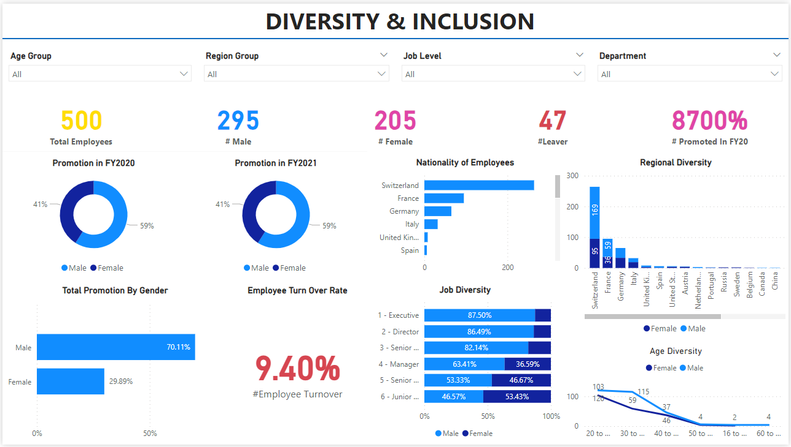

# 📊 HR Analytics KPIs Dashboard using Power BI

## 📌 Project: HR Gender Diversity and Inclusion Analytics

---

## 🔖 Key Features

* Analyze gender diversity and inclusion data in an interactive way
* Track key HR metrics like age distribution, region, job roles, promotions, and turnover rate
* Gain insights into workforce diversity across different dimensions

---

## 📊 KPI Metrics

---

## 📈 HR Diversity Dashboard

---

## 📊 KPI Findings

---

## 🏗️ Tools Used

* Microsoft Power BI (Data Visualization & Dashboarding)
* Microsoft Excel (Data Cleaning & Preparation)

---

## 🚀 Project Benefits

📌 Improves transparency in gender diversity

📌 Helps identify and address diversity gaps

📌 Enables data-driven HR decision-making

📌 Tracks important HR metrics over time

---

## 📂 How to Use

1. Clone the repository
2. Open the `.pbix` file in Power BI Desktop
3. Explore dashboards and insights

---

## ⭐ Support

If you find this project useful, consider giving it a ⭐ on GitHub!

### This project uses data analytics to understand gender diversity and inclusion in the company. The Power BI dashboard and KPIs empower HR and management to track metrics, address issues, and make informed decisions to enhance workplace diversity. The ultimate goal is to create a fair and inclusive work environment for all employees.

## Project Link :
HR Diversity Inclusion Dashboard.pbix
